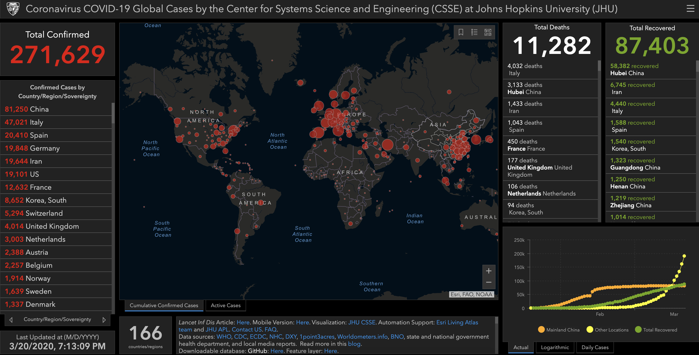

# covid-model-list
Ongoing list of covid-19 models, visualizations

# datasets
1. Novel Coronavirus (COVID-19) Cases, provided by JHU CSSE  https://github.com/CSSEGISandData/COVID-19
2. Midas Data and Research Portal - https://github.com/midas-network/COVID-19
- Disease Catalog - https://midasnetwork.us/covid-19/, Public-access data collections with documented metadata. (Click on a collection name to see the collection in GitHub.)
- Parameter Estimates - Peer-reviewed Published estimates of epidemiological characteristics that have been peer-reviewed, encoded by community members and approved by authors. For complete information on each estimate, view this file on GitHub https://github.com/midas-network/COVID-19/blob/master/parameter_estimates/2019_novel_coronavirus/estimates.csv
- Parameter Estimates - Not peer-reviewed Published estimates of epidemiological characteristics that have not been peer-reviewed, encoded by community members and approved by authors. For complete information on each estimate,https://github.com/midas-network/COVID-19/blob/master/parameter_estimates/2019_novel_coronavirus/estimates.csv
- Software Catalog - Listing of software created by community members, with documented metadata. (Click on a software name to open the software webpage.)
3. Chinese nCov Memory -  Memory of 2020 nCoV: Media Coverage, Non-fiction Writings, and Individual Narratives (Continuously updating) https://github.com/2019ncovmemory/nCovMemory, About - https://qz.com/1811018/chinese-citizens-use-github-to-save-coronavirus-memories/ here: https://2019ncovmemory.github.io/nCovMemory/
4. Raw data in Wuhan, Hubei, and Guangzhou for serious COVID-19 cases, and Wuhan hospitalization data - https://github.com/c2-d2/COVID-19-wuhan-guangzhou-data for *Ruoran, Li, Caitlin Rivers, Qi Tan, Megan B Murray, Eric Toner, and Marc Lipsitch. The Demand for Inpatient and ICU Beds for COVID-19 in the US: Lessons From Chinese Cities (March 2020).* https://dash.harvard.edu/handle/1/42599304
5. Google Sheets From DXY.cn Google Sheets - https://docs.google.com/spreadsheets/d/1jS24DjSPVWa4iuxuD4OAXrE3QeI8c9BC1hSlqr-NMiU/edit#gid=1187587451
6. Kaggle Dataset - https://www.kaggle.com/sudalairajkumar/novel-corona-virus-2019-dataset, Johns Hopkins University has made an excellent dashboard using the affected cases data. Data is extracted from the google sheets associated and made available here.
7. Nextstrain - https://github.com/nextstrain/ncov - The hCoV-19 / SARS-CoV-2 genomes were generously shared via GISAID. We gratefully acknowledge the Authors, Originating and Submitting laboratories of the genetic sequence and metadata made available through GISAID on which this research is based. For a full list of attributions please see the metadata file.
8. ECDC Download today’s data on the geographic distribution of COVID-19 cases worldwide - https://www.ecdc.europa.eu/en/publications-data/download-todays-data-geographic-distribution-covid-19-cases-worldwide
9. BNO - https://bnonews.com/index.php/2020/02/the-latest-coronavirus-cases/

# Visualizations - Maps, Descriptive Charts, Dashboards
1. Mapping 2019-nCoV - https://www.thelancet.com/journals/laninf/article/PIIS1473-3099(20)30120-1/fulltext (Dong E, Du H, Gardner L. An interactive web-based dashboard to track COVID-19 in real time. Lancet Infect Dis; published online Feb 19. https://doi.org/10.1016/S1473-3099(20)30120-1), uses ArcGIS
</img>
2.  Covid-19 Dashboards - https://covid19dashboards.com/, Github https://github.com/github/covid19-dashboard
- Part 1 Statistics by Country: https://covid19dashboards.com/covid-overview/#Part-One:-Statistics-By-Country
- Part 2 Part Two: United States, by State - https://covid19dashboards.com/covid-overview/#Part-Two:-United-States,-by-State
- COVID-19 Deaths Per Capita - https://covid19dashboards.com/covid-compare-permillion/
- How many cases of COVID-19 does each U.S. state really have? - https://covid19dashboards.com/covid-19-us-case-estimation/
- Compare Country Trajectories - Total Cases - https://covid19dashboards.com/compare-country-trajectories/
- Compare Country Trajectories - Death Rate - https://covid19dashboards.com/compare-country-death-trajectories/
- Interactive Map - Confirmed Cases in the US by State - https://covid19dashboards.com/growth-map-us-states/
- Changes In The Daily Growth Rate - https://covid19dashboards.com/growth-analysis/
- COVID-19 Exploratory Data Analysis - https://covid19dashboards.com/corona-eda/
- COVID-19 Growth By State (US) - https://covid19dashboards.com/growth-us-states/
3. HealthMap alert notifications - https://healthmap.org/wuhan/
4. HealthMap/John Brownstein Covid-19 Map - https://www.healthmap.org/covid-19/
5. Covid-19 spread, Chinese Disease Control - http://2019ncov.chinacdc.cn/2019-nCoV/
6. New York Times/Lai R KK, et al., Coronavirus Map: Tracking the Global Outbreak - https://www.nytimes.com/interactive/2020/world/coronavirus-maps.html
7. European Centre for Disease Prevention and Control, https://darwinanddavis.github.io/worldmaps/coronavirus.html (Github: https://github.com/darwinanddavis/worldmaps)
8. University of Virginia - COVID-19 Surveillance Dashboard, http://ncov.bii.virginia.edu/dashboard/
9. University of Virginia  - COVID-19 Cases and Clusters Outside of China, https://datastudio.google.com/u/0/reporting/f6ad0988-f203-45f8-8d18-5d726c1d2d8b/page/MGzDB
10. University of Washington HGIS Lab - https://hgis.uw.edu/virus/ (Github: https://github.com/jakobzhao/virus)
11. nCov2019 for studying COVID-19 coronavirus outbreak, Tianzhi Wu, Erqiang Hu, Patrick Tung, Xijin Ge, Guangchuang Yu - nCov2019: An R package with real-time data, historical data and Shiny app (https://guangchuangyu.github.io/nCov2019/)
12. Dipartimento della Protezione Civile COVID-19 Italia - Monitoraggio della situazione - http://opendatadpc.maps.arcgis.com/apps/opsdashboard/index.html#/b0c68bce2cce478eaac82fe38d4138b1
13. Esri Story Map Mapping the novel coronavirus outbreak - https://storymaps.arcgis.com/stories/4fdc0d03d3a34aa485de1fb0d2650ee0
14. World Health Organization. Novel coronavirus (COVID-19) situation (public dashboard) - https://who.maps.arcgis.com/apps/opsdashboard/index.html#/c88e37cfc43b4ed3baf977d77e4a0667
15. Google by covid-2019 Reddit Map Community - https://www.google.com/maps/d/u/0/viewer?mid=1yCPR-ukAgE55sROnmBUFmtLN6riVLTu3&ll=30.359193252484147%2C0&z=2
16. COVID19 Infodemics Observatory - https://covid19obs.fbk.eu/, CoMuNe Labs
17. Bing COVID Tracker - https://www.bing.com/covid
18. E-Tracking map of the #CoViD19 in Africa - http://umap.openstreetmap.fr/fr/map/e-tracking-map-of-the-covid19-in-africa_411333#3/10.13/45.34
19. Vox - 11 coronavirus pandemic charts - https://www.vox.com/future-perfect/2020/3/12/21172040/coronavirus-covid-19-virus-charts
20. Early Alert - https://early-alert.maps.arcgis.com/apps/opsdashboard/index.html#/20bfbf89c8e74c0494c90b1ae0fa7b78
21. EpiRisk -  http://epirisk.net/#eyJxdWVyeSI6eyJ0cmF2ZWxMZXZlbCI6MSwicGVyaW9kIjoxMCwidG90YWxDYXNlcyI6MzEyMDAsImRpc3RyaWJ1dGlvbk1vZGUiOiJ1bmlmb3JtIiwibW9udGgiOiJKYW4iLCJnZW9MZXZlbCI6ImJhc2luIiwic291cmNlcyI6W3siaWQiOjQ3NywiY2FzZXMiOjF9XX0sIm1hcCI6eyJjZW50ZXIiOlsxNDguMzUxMDAyNzk3Mzk1NzIsMzEuOTYyMDM3NzEzMjQ4MzM2XSwiem9vbSI6MiwicGl0Y2giOjAsImJlYXJpbmciOjB9fQ==
22. WorldoMeters- https://www.worldometers.info/coronavirus/
23. Covid2019app Live Site - https://covid2019app.live/

# models

| Num  | Model/Link             | Description                           | Authors     |
| --- | ------------------------|---------------------------------------| ------------| 
|  1 | COVID-19 Growth Rate Prediction - https://covid19dashboards.com/growth-bayes/   | We assume a negative binomial likelihood as we are dealing with count data. A Poisson could also be used but the negative binomial allows us to also model the variance separately to give more flexibility. | Thomas Wiecki, @HamelHusain
|  2 | Estimating The Mortality Rate For COVID-19 - https://covid19dashboards.com/covid-19-mortality-estimation/#Interpretation-of-Country-Level-Parameters  | Using Country-Level Covariates To Correct For Testing & Reporting Biases And Estimate a True Mortality Rate. (Github model: https://github.com/jwrichar/COVID19-mortality) | @HamelHusain, @jwrichar
|  3 | NobBS: Nowcasting by Bayesian Smoothing - https://github.com/sarahhbellum/NobBS  | NobBS is Bayesian approach to estimate the number of occurred-but-not-yet-reported cases from incomplete, time-stamped reporting data for disease outbreaks. NobBS learns the reporting delay distribution and the time evolution of the epidemic curve to produce smoothed nowcasts in both stable and time-varying case reporting settings. | sarahhbellum
|  4 | Scenario analysis for the transmission of COVID-19 in Georgia - http://2019-coronavirus-tracker.com/stochastic-GA.html  | The epidemiology of COVID-19 in the United States is poorly understood. To better understand the potential range of epidemic outcomes in the state of Georgia, we developed a model based on data from Hubei Province, China calibrated to regionally specific conditions in Georgia and observations of the number of reported cases in Georgia in early March. Github - https://github.com/CEIDatUGA/ncov-wuhan-stochastic-model | The Center for the Ecology of Infectious Diseases (CEID) at the University of Georgia
|  5 | Probability of widespread transmission - http://2019-coronavirus-tracker.com/final-size.html | http://2019-coronavirus-tracker.com/final-size.html; Github (private) - https://github.com/CEIDatUGA/ncov-coupled-outbreaks | The Center for the Ecology of Infectious Diseases (CEID) at the University of Georgia
|  6 | Spatial Spread of 2019 novel coronavirus in China - http://2019-coronavirus-tracker.com/spatial-china.html  | We developed a gravity-based model to better understand the risk of spatial spread of the 2019-nCov at the prefecture level in China, and to determine the efficacy of quarantines imposed in Wuhan and other prefectures. Github (private) - https://github.com/CEIDatUGA/CoronavirusSpatial | The Center for the Ecology of Infectious Diseases (CEID) at the University of Georgia
|  7 | Effect of early intervention on outbreak size of COVID-19 in China - http://2019-coronavirus-tracker.com/early-intervention.html  | The epidemic of COVID-19 reached different areas of China at different times. This means that different locations were at different phases of outbreak at the time of the Wuhan lockdown (23 January) and other provincial and national actions. This provides what is sometimes called a “natural experiment” becuase it is as if replicate epidemics had been induced and then intervened on at different times. By looking at the effect of timing on outbreak size, we can draw conclusions about the effect of delaying intervention, which may be informative to other countries that are considering taking action. Github - https://github.com/CEIDatUGA/ncov-early-intervention | The Center for the Ecology of Infectious Diseases (CEID) at the University of Georgia
|  8 | Effect of mass testing - http://2019-coronavirus-tracker.com/mass_testing.html | A symptom-based mass screening and testing intervention (MSTI) can identify a large fraction of infected individuals during an infectious disease outbreak. China is currently using this strategy for the COVID-19 outbreak. However, MSTI might lead to increased transmission if not properly implemented. We investigate under which conditions MSTI is beneficial. Github (private) - https://github.com/CEIDatUGA/CoV_MassTesting | The Center for the Ecology of Infectious Diseases (CEID) at the University of Georgia
|  9 | Epidemic Data Curves, Maps - http://2019-coronavirus-tracker.com/data.html  | Github (private) - https://github.com/CEIDatUGA/ncov-data-summary | The Center for the Ecology of Infectious Diseases (CEID) at the University of Georgia
|  10 | Nowcasting the current size of the COVID-19 outbreak in the United States - http://2019-coronavirus-tracker.com/nowcast.html | At any given time, most COVID-19 cases are circulating in the community and not known to us. We wish to estimate the total current size of the COVID-19 outbreak (the total number of unnotified individuals currently infected with SARS-CoV2). Github (private) https://github.com/CEIDatUGA/ncov-nowcast, Global and US Parameters http://2019-coronavirus-tracker.com/parameters | The Center for the Ecology of Infectious Diseases (CEID) at the University of Georgia
|  11 | Speed of Spread of COVID-19 - http://2019-coronavirus-tracker.com/speed-of-spread.html By US State and Global  | Epidemics of COVID-19 are occuring at different times across the United States so it is important to compare the spread of an epidemic in a given state with the appropriate stage in other countries. The following figures show the cumulative number of cases in a state by number of days since the 100th case, number of days since the 1st case, and by calendar date, respectively. Github (private) https://github.com/CEIDatUGA/ncov-data-summary | The Center for the Ecology of Infectious Diseases (CEID) at the University of Georgia
|  12 | COVID-19 in Context - http://2019-coronavirus-tracker.com/context.html  | How does the 2019 novel coronavirus disease (COVID-19) epidemic compare in severity to other recent disease outbreaks? We gathered data from existing studies to put COVID-19 into context. Github (private) https://github.com/CEIDatUGA/ncov-context | The Center for the Ecology of Infectious Diseases (CEID) at the University of Georgia
|  13 | Estimating $R_0$ and other parameters for the 2019-nCov epidemic | The epidemiology of the global 2019-nCov is poorly understood. Identifying the key processes that shape transmission and estimating the relevant model parameters is therefore an important task. This document presents arguments and analysis to support the estimation of a number of key quantities - Epidemic curve, Basic reproduction number ($R_0$), Case detection rate (q), Incubation period ($\frac{1}{/sigma}$), Lag between symptom onset and isolation, Transmissibility ($\beta$), Additional parameters; Notebook HTML - http://2019-coronavirus-tracker.com/parameters-supplement.html | The Center for the Ecology of Infectious Diseases (CEID) at the University of Georgia
|  14 | Estimation of the effective reproduction number of COVID-19 outside China - http://2019-coronavirus-tracker.com/reff-outside.html | What is the average $R_{eff}$ outside of China? | The Center for the Ecology of Infectious Diseases (CEID) at the University of Georgia
|  15 | COVID-19 Growth Rate Prediction - http://2019-coronavirus-tracker.com/stochastic.html | We developed a stochastic model to better understand the transmission of 2019-nCov in Hubei (primarily Wuhan). The model includes several features of the Wuhan outbreak that are absent from most compartmental models that otherwise confound the interpretation of data, including time-varying rates of case detection, patient isolation, and case notification. Github - https://github.com/CEIDatUGA/ncov-wuhan-stochastic-model, HTML http://2019-coronavirus-tracker.com/stochastic-model.html | The Center for the Ecology of Infectious Diseases (CEID) at the University of Georgia
|  16 | Extended state-space SIR epidemiological models - https://github.com/lilywang1988/eSIR  | R package eSIR: extended state-space SIR epidemiological models. The standard SIR model has three components: susceptible, infected, and removed (including the recovery and dead). In the following sections, we will introduce the other extended state-space SIR models and their implementation in the package. The results provided below are based on relatively short chains. | @lilywang1988
|  17 | JSON time-series of coronavirus cases (confirmed, deaths and recovered) per country - updated daily - https://github.com/pomber/covid19 | Transforms the data from CSSEGISandData/COVID-19 into a json file. Available at https://pomber.github.io/covid19/timeseries.json. Updated three times a day using GitHub Actions. | @pomber
|  18 | Genomic epidemiology of novel coronavirus - https://nextstrain.org/ncov?c=country  | Showing 838 of 838 genomes sampled between Dec 2019 and Mar 2020 | the NextStrain Team | nextstrain
|  19 | Phylodynamic Analysis - http://virological.org/  | Novel 2019 coronavirus category| virological
|  20 | Genomic epidemiology of hCoV-19 - https://www.gisaid.org/epiflu-applications/next-hcov-19-app/ | Showing 838 of 838 genomes sampled between Dec 2019 and Mar 2020.| GISAID
|  21 | Don’t “Flatten the Curve,” squash it!, with simulations Modeling COVID-19 Spread vs Healthcare Capacity - https://alhill.shinyapps.io/COVID19seir/?fbclid=IwAR2aXJT79M2AmZxMdy8jsiEuSC4i7ijU8Av6oB4dmlZIeJ2VQgL7Tt3QGxA | The graph shows the expected numbers of individuals over time who are infected, recovered, susceptible, or dead over time. Infected individuals first pass through an exposed/incubation phase where they are asymptomatic and not infectious, and then move into a symptomatic and infections stage classified by the clinical status of infection (mild, severe, or critical).  | Alison Hill, Joscha Bach
|  22 | Impact of non-pharmaceutical interventions (NPIs) to reduce COVID19 mortality and healthcare demand - https://www.imperial.ac.uk/media/imperial-college/medicine/sph/ide/gida-fellowships/Imperial-College-COVID19-NPI-modelling-16-03-2020.pdf | Here we present the results of epidemiological modelling which has informed policymaking in the UK and other countries in recent weeks. | Imperial College COVID-19 Response Team, Neil M Ferguson et al.
|  23 | *Li, Ruiyun, et al. "Substantial undocumented infection facilitates the rapid dissemination of novel coronavirus (SARS-CoV2)." Science (2020)* https://science.sciencemag.org/content/early/2020/03/13/science.abb3221  | Here we use observations of reported infection within China, in conjunction with mobility data, a networked dynamic metapopulation model and Bayesian inference, to infer critical epidemiological characteristics associated with SARS-CoV2, including the fraction of undocumented infections and their contagiousness. | Li, Ruiyun, et al
|  24 | *Chan, Jasper Fuk-Woo, et al. "A familial cluster of pneumonia associated with the 2019 novel coronavirus indicating person-to-person transmission: a study of a family cluster." The Lancet 395.10223 (2020): 514-523.* https://www.thelancet.com/journals/lancet/article/PIIS0140-6736(20)30154-9/fulltext?fbclid=IwAR1YTPBtlNUrZRvcE9sSBnOzJTOUR8sVK4nc54le5k4xXF3_WvjSuKW5BBU  | In this study, we report the epidemiological, clinical, laboratory, radiological, and microbiological findings of five patients in a family cluster who presented with unexplained pneumonia after returning to Shenzhen, Guangdong province, China, after a visit to Wuhan, and an additional family member who did not travel to Wuhan. | Chan, et al.
|  25 | R library (coronavirus)  https://ramikrispin.github.io/coronavirus/  | Github repo is here https://github.com/RamiKrispin/coronavirus | @RamiKrispin
|  26 | Innophore  protein modeling https://innophore.com/2019-ncov/  | Validating the protease sequence | Innophore
|  27 | Wuhan coronavirus 2019-nCoV protease homology model - https://3dprint.nih.gov/discover/3DPX-012867| | Homolgy model by Phyre2 of the Wuhan coronavirus 2019-nCoV protease, https://innophore.com/2019-ncov From a PDB file in the PyMol session linked in that article.| NIH 
|  28 | *Wu, Peng, et al. "Real-time tentative assessment of the epidemiological characteristics of novel coronavirus infections in Wuhan, China, as at 22 January 2020." Eurosurveillance 25.3 (2020).* https://www.ncbi.nlm.nih.gov/pmc/articles/PMC6988272/#!po=31.2500  | Information on reported cases strongly indicates human 
to human spread, and the most recent information is increasingly indicative of sustained human to human transmission. | Wu, et al. 
|  29 | Preliminary risk analysis of 2019 novel coronavirus spread within and beyond China 25 January 2020  https://www.worldpop.org/events/china  |  ...explore patterns of mobility of travellers from Wuhan to
other cities in China, and inform the risk of 2019 nCoV spreading across and beyond the country during the Lunar New Year migration. | Shengjie Lai, et al.

# Channels and Social Media
1. Covid-2019 Reddit Map Community - https://www.reddit.com/r/CovidMapping/

